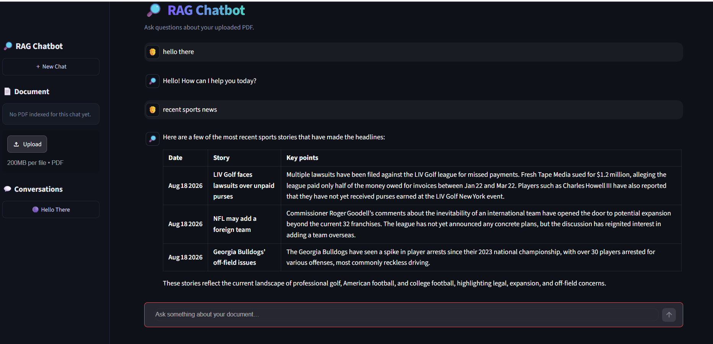
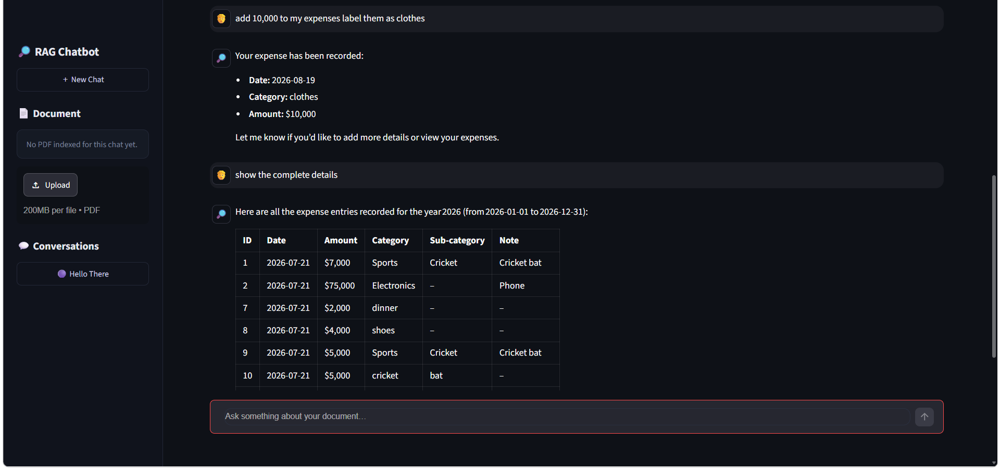
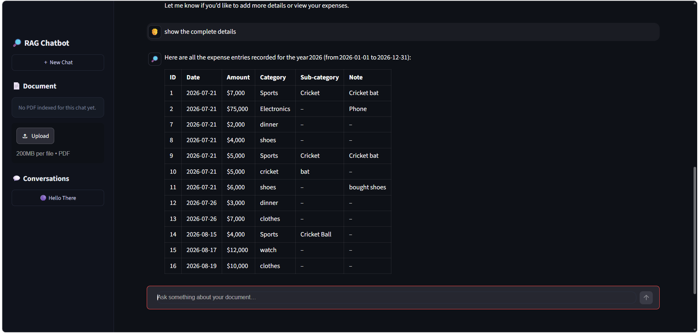
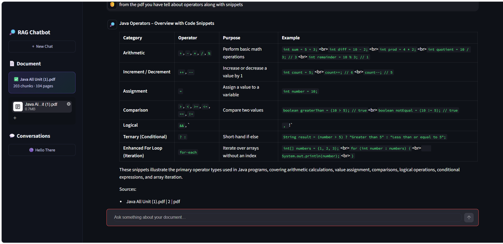

# RAG Chatbot

A PDF-grounded chatbot built with LangGraph, hybrid retrieval (BM25 + FAISS), and cross-encoder reranking — plus live web search, an MCP-based expense tracker, stock prices, and a calculator, all wired into a single tool-calling agent.

## Features

### 1. Chat + Live Web Search (Tavily)

General conversation with access to real-time web search when a question needs current information beyond the uploaded document.



### 2. MCP-Based Expense Tracker

A FastMCP expense tracker server integrated via `langchain-mcp-adapters` — add expenses conversationally, then query them back as structured tables.




### 3. RAG over PDFs

Upload a PDF and ask questions grounded in its actual content — hybrid search (BM25 + FAISS) retrieves relevant chunks, a cross-encoder reranks them, and answers are generated with page-level citations.



## Tech Stack

- **Orchestration:** LangChain, LangGraph
- **LLM:** Groq (`openai/gpt-oss-20b`)
- **Retrieval:** BM25 (sparse) + FAISS (dense) combined via Reciprocal Rank Fusion, with Maximal Marginal Relevance for diversity
- **Embeddings:** HuggingFace (`BAAI/bge-small-en-v1.5`)
- **Reranking:** Cross-encoder (`cross-encoder/ms-marco-MiniLM-L-6-v2`)
- **Query expansion:** HyDE (Hypothetical Document Embeddings)
- **Tools:** MCP expense tracker (FastMCP + stdio transport), Tavily web search, Alpha Vantage stock prices, calculator
- **Frontend:** Streamlit, with per-thread conversation history via LangGraph's checkpointer

## Key Engineering Details

- **Page-boundary-safe chunking** — PDF pages are merged into one continuous text before splitting, so sentences that happen to span a page break aren't truncated mid-sentence (a real, previously-fixed retrieval bug).
- **Case-insensitive BM25 matching** — the default tokenizer is case-sensitive, which silently drops matches on proper nouns; fixed via a custom `preprocess_func`.
- **Dual-query retrieval** — both the raw query and its HyDE expansion are searched independently and merged, since HyDE's generic hypothetical text can miss specific named entities.
- **Multi-conversation threads** — each chat thread has its own isolated document index and history, with a thread-scoped file uploader to prevent cross-thread document leakage.

## Setup

```bash
git clone https://github.com/Raghav-012/RAG_chatbot.git
cd RAG_chatbot
python -m venv venv
venv\Scripts\activate        # Windows
pip install -r requirements.txt
```

Create a `.env` file with your API keys:

```
GROQ_API_KEY=your_key_here
TAVILY_API_KEY=your_key_here
ALPHAVANTAGE_API_KEY=your_key_here
```

Run the app:

```bash
streamlit run frontend.py
```

## License

MIT
